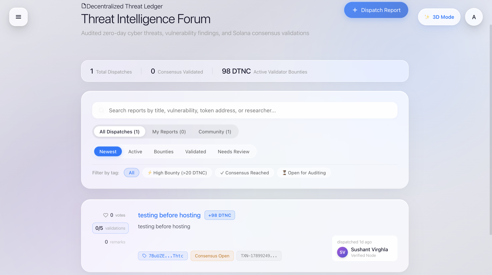

<div align="center">

# 🛡️ DATIN: Decentralized Autonomous Threat Intelligence Network

### **Next-Gen Cybersecurity RAG Sentinel & On-Chain Solana Threat Consensus Protocol**

[](https://solana.com)
[](https://fastapi.tiangolo.com)
[](https://react.dev)
[](https://www.pinecone.io)
[](https://vitejs.dev)
[](https://www.docker.com)
[](LICENSE)

<br/>

<p align="center">
  <b>DATIN</b> is an autonomous cybersecurity ecosystem bridging <b>high-performance Retrieval-Augmented Generation (RAG)</b> with a <b>decentralized on-chain threat audit ledger</b> powered by Solana. Security researchers audit vulnerabilities, achieve multi-party consensus, earn <b>DTNC tokens</b>, and index verified threat data into high-dimensional vector memory in real time.
</p>

[Explore Features](#-key-features) • [System Architecture](#-system-architecture) • [Workflow](#-end-to-end-workflow) • [Tech Stack](#-tech-stack) • [Quickstart](#-quickstart-guide)

---

</div>

<br/>

## 📸 Visual Showcase

<div align="center">
  <h3>🤖 1. 3D AI Cybersecurity Sentinel & Streaming RAG</h3>
  <p><i>Autonomous conversational threat agent grounded in MITRE ATT&CK and live vulnerability intelligence.</i></p>
  
</div>

<br/><br/>

<div align="center">
  <h3>📜 2. Decentralized Threat Ledger & Consensus Forum</h3>
  <p><i>StackOverflow-style decentralized threat intelligence ledger with escrowed DTNC bounties and on-chain validator consensus.</i></p>
  
</div>

<br/>

---

## ⚡ Key Features

### 🧠 1. Real-Time Cybersecurity RAG Agent
- **Domain-Specific Grounding**: Ingests MITRE ATT&CK matrices, CVE intelligence, and verified on-chain threat disclosures.
- **Low-Latency Streaming**: Accelerated chunk streaming response pipeline powered by FastAPI, SentenceTransformers, and Gemini/Ollama LLM routing.
- **3D Spatial Interface**: Interactive Spline 3D humanoid model with seamless fallback **Speed Mode** for 120 FPS high-performance across low-power and mobile devices.

### ⛓️ 2. Solana Token-2022 Consensus & Escrow
- **Native DTNC Mint**: Powered by Solana’s modern **Token-2022 Program** (`mntHo2pnnFBctoQ2AozsnZeCfjyk2ehDzwAkmFnr4s3`) with 9 decimal precision.
- **Minimum 3 Validator Consensus**: Reports require a minimum quorum of 3 independent security nodes before verification can be finalized.
- **Pre-Flight Escrow Check**: Prevents spam by cryptographically verifying the submitter holds sufficient DTNC balance (`Reward × Validators`) in their connected Phantom wallet before dispatching to the ledger.
- **Automated Payout Engine**: Instantly transfers DTNC bounties to each validator’s on-chain wallet upon consensus completion with cryptographic transaction signatures.

### 🧬 3. Automated Vector Database Ingestion
- **Neural Embeddings**: Automatically transforms verified vulnerabilities and exploit vectors into 1024-dimensional normalized vector embeddings.
- **Pinecone Cloud Integration**: Upserts verified threat intelligence into dedicated namespaces (`verified-threats`) accessible to AI agents worldwide.
- **Resilient Local Vector DB**: Simultaneously mirrors vectors to persistent local storage with zero loss guarantees if external cloud endpoints encounter outages.

### 🔒 4. Enterprise-Grade Security & Privacy
- **Identity Obfuscation**: Zero email leaks. Researcher dispatches and consensus votes strictly display verified node aliases and deterministic cryptographic avatar gradients.
- **Encrypted Local Storage**: Sensitive node records are safeguarded using AES-256-CBC encryption with SHA-256 tamper-proof checksum verification and automated backups.
- **Defensive Web3 Invariant Traps**: Specialized Chromium and Brave Browser error boundaries that safeguard against third-party extension proxy collisions.

---

## 🏛️ System Architecture

```mermaid
graph TD
    subgraph Client ["Client (React 19 + Vite)"]
        UI["Apple Glassmorphism UI"]
        Spline["3D Humanoid Sentinel"]
        Wallet["Phantom / Solana Wallet"]
    end

    subgraph NodeBackend ["Node.js API & Consensus Engine"]
        Auth["Anti-Abuse Auth & OTP"]
        Escrow["DTNC Pre-Flight Balance Checker"]
        Ledger["Decentralized Threat Ledger"]
        CryptoStorage[("AES-256-CBC Encrypted Store")]
    end

    subgraph Blockchain ["Solana Devnet (Token-2022)"]
        Treasury["Treasury Vault"]
        Mint["DTNC Mint Authority"]
        ATA["Validator Token Accounts"]
    end

    subgraph AI_Engine ["AI & Vector Intelligence (Docker / Python)"]
        RAG["FastAPI Stream RAG Router"]
        Model["SentenceTransformer (1024-dim)"]
        Pinecone[("Pinecone Vector Database")]
        Ingest["ingest_verified_reports.py"]
    end

    UI -->|Submits Threat Dispatch| Escrow
    Wallet -->|Verifies ATA Balance| Escrow
    Escrow -->|Stores Encrypted| CryptoStorage
    UI -->|Validator Consensus Quorum (Min 3)| Ledger
    Ledger -->|Trigger Reward Distribution| Treasury
    Treasury -->|Transfer DTNC Tokens| ATA
    Ledger -->|Trigger Ingestion| Ingest
    Ingest -->|Generate Normalized Embedding| Model
    Model -->|Upsert Threat Vectors| Pinecone
    UI -->|Query Security Findings| RAG
    RAG -->|Semantic Search| Pinecone
